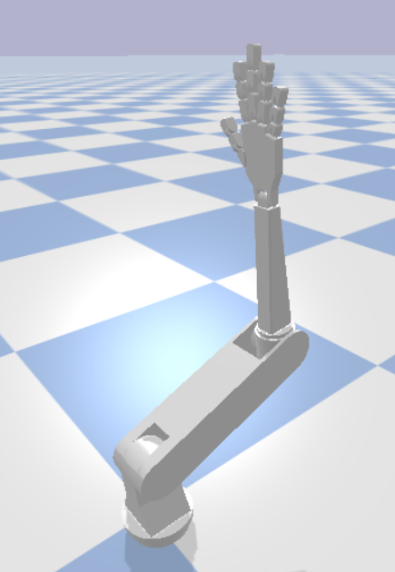
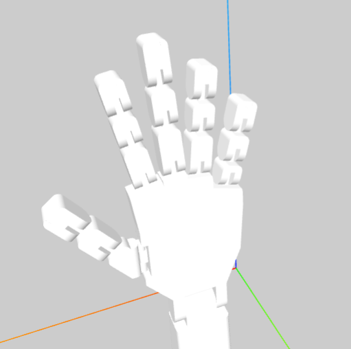

# OpenCV-HandBot

A real-time robotic hand simulation controlled by your own hand movements using MediaPipe, OpenCV, and PyBullet. The project maps real hand position, orientation, and finger states to a robotic hand URDF model, enabling natural teleoperation of a virtual robot hand.

## HandBot Teleoperation

Control a simulated robotic hand in real time using your own hand gestures!  
This project uses **MediaPipe** for hand tracking, **OpenCV** for camera input, and **PyBullet** for physics-based simulation of a custom URDF robotic hand model.

## Features

- Real-time hand tracking via webcam using [MediaPipe Hands](https://developers.google.com/mediapipe/solutions/vision/hand_landmarker).
- Maps **hand position** directly to the robotic hand’s wrist joint.
- Each finger joint is mapped to open/close gestures:
  - Detects finger state (`open` / `closed`) with MediaPipe landmarks.
  - Model Training for hands for  **special finger combinations** (e.g., index + thumb pinch).
- Ensures the palm stays **upright** in simulation, avoiding noisy Z-axis roll from MediaPipe.
- Physics-based simulation with [PyBullet](https://pybullet.org/wordpress/).
- Easy setup using `requirements.py`.

## URDF Model

The URDF Model is created in Fusion 360 and then converted to URDF using [fusion2urdf by syuntoku14](https://github.com/syuntoku14/fusion2urdf).


It has a accurately modelled arm with 15 joint hand ( 3 for each finger ) allowing for a fluid motion of fingers.


## Setup
1. Clone the github repository and install the requirements ( if you want, you can create a virtual environment )
```
git clone https://github.com/DevashishHarsh/OpenCV-HandBot
python -m venv venv # If you want a virtual environment

source venv/bin/activate # Linux / Mac
.\venv\Scripts\activate # Windows

pip install -r requirements.txt
```
2. Run the handcontrol.py and it will automatically start the pybullet with your webcam.
```
python handcontrol.py
```

### Training OpenCV Model

I also added a OpenCV Training Model into this file as it can be used along with the high quality Handbot.urdf to create many combinations of hand signs and movements for the robot.
> I will add a GUI and other features soon to make this easy and intuitive.

#### To Train the model, you need to first create the dataset for the pose.
1. Open the trainer folder and hand_trainer.py which will give you options to create dataset for the poses ( 100 samples is enough ).
```
cd trainer
python hand_trainer.py
```
#### Options for training
- Auto mode : Press "a" to let the program automatically capture your hand position while moving your hand around for better coverage.
- Manual mode : Press "s" whenever you want to save a sample for the hand pose. This allows precision as to when you want to capture the position. ( You can also spam it )

> Press "n" after 100 samples to collect data for a new pose or "esc" to exit.

**The trainer also has a file checker that helps you in check the files and also open the colab notebook that will help you train your model based on your dataset. You will be prompted to run it after every data collection run so make sure to keep your dataset in check**

You can open the training colab file from this [](https://colab.research.google.com/github/DevashishHarsh/OpenCV-HandBot/blob/main/Train_Hand_Model.ipynb) or using the file checker.
> All the created files will be in the model folder and also the files downloaded from colab should be put inside the "training_data" folder to run modelrun.py to check the trained model.
```
cd trainer/training_data
python modelrun.py
```
## Future of this project
I will add new functionalities and GUI to add custom actions for the hand using trained model. You will be able to create many interactions like "showing your palm" to trigger an animation from the hand robot.

## License
This repository is provided under the MIT License.


